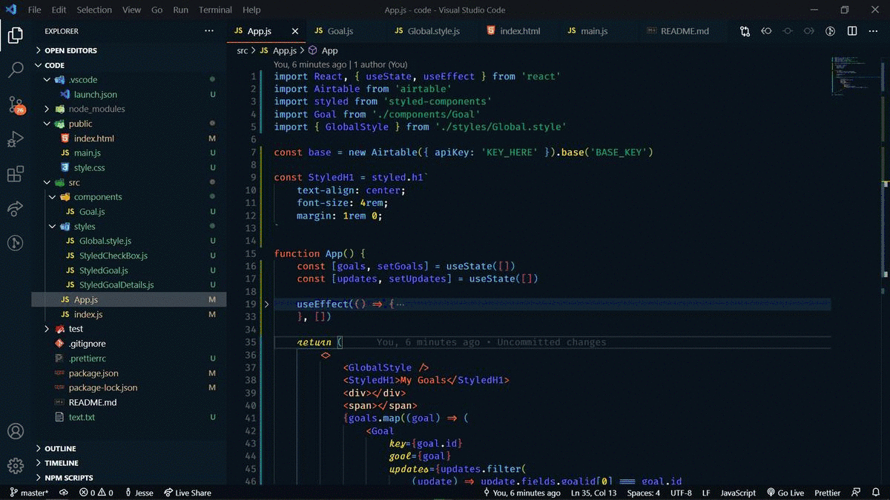

<p align="center"></p>
<h1 align="center"> vscode guide </h1> 
<h4 align="right">Febrary 24</h4>


<br>

## Shortcut


> :bulb: **Tip:** ```F1``` paleta de comandos de VSCode (Command Palette) o <kbd>Ctrl</kbd> + <kbd>Mayús</kbd> + <kbd>P</kbd>


### Crear un pagina basica
1. creamos archivo nuevo
2. salvamos como index.html
3. escribimos segun sea el caso:
```
html:5
html:xml
```
4. enter


## Live server 
desde un archivo html- boton derecho Open with Live Server <kbd>alt</kbd>+<kbd>L</kbd> 
si no abre, desde el Browser
```
http://127.0.0.1:5500/index.html
```

> :memo: **Note:** Debes abrir la carpeta desde VScode donde esta todo el proyecto


<br>

---
Copyright &copy; 2022 [carjavi](https://github.com/carjavi). <br>
```www.instintodigital.net``` <br>
carjavi@hotmail.com <br>
<p align="center">
    <a href="https://instintodigital.net/" target="_blank"></a>
</p>


